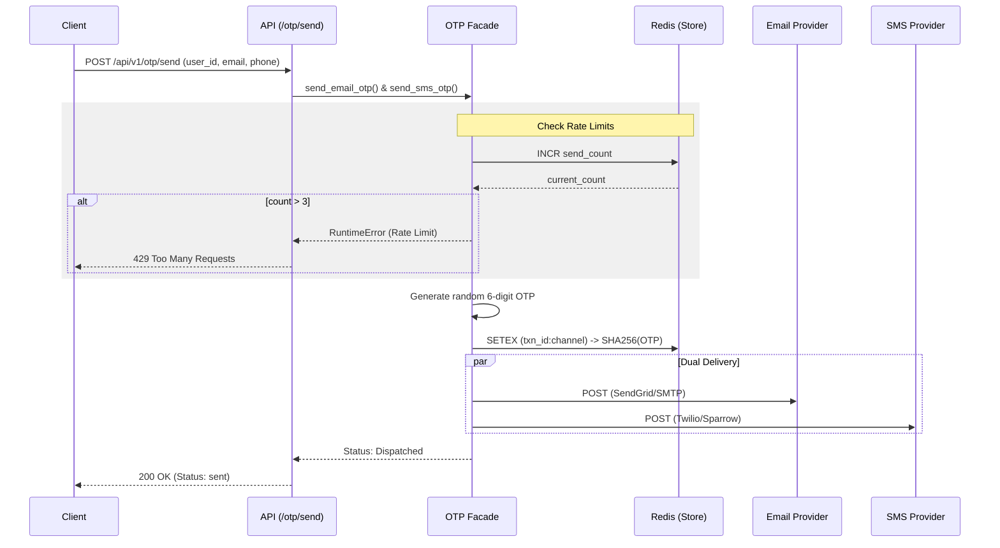
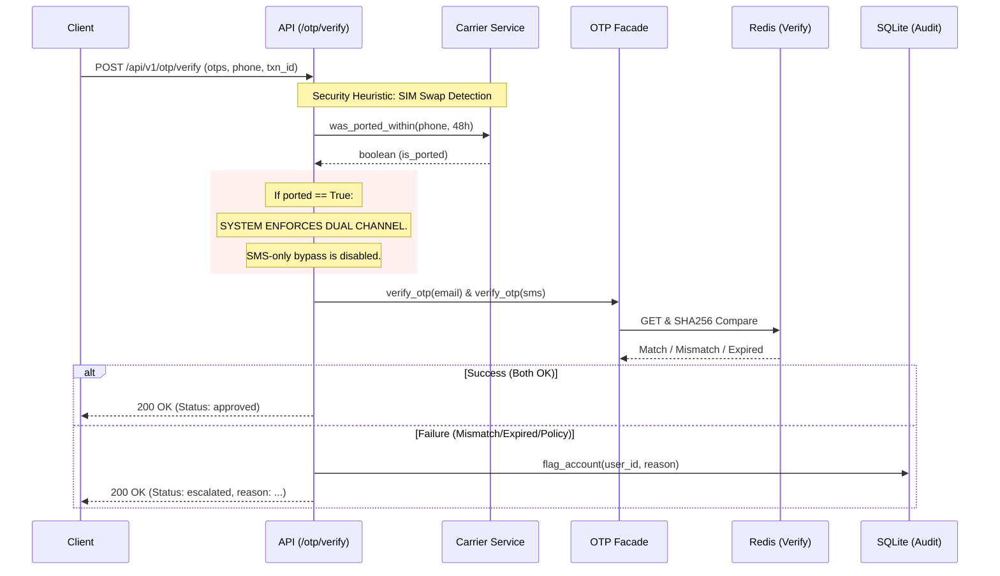

# GIBL OTP Service — Project Workflow & Architecture

This document outlines the complete technical workflow, security model, and system architecture of the refactored GIBL OTP microservice.

---

## 🏗️ System Architecture

The service follows a **Modular Facade** pattern. The API routes interact only with the `OTPService` facade, which coordinates specialized sub-services.

```mermaid
graph TD
    Client[Client Browser/App] -->|REST API| FastAPI{FastAPI Server}
    
    subgraph API Layer
        FastAPI --> RT_OTP[OTP Router]
        FastAPI --> RT_HEALTH[Health Router]
    end

    subgraph Service Layer (Facade)
        RT_OTP --> SVC_OTP[OTP Service Facade]
    end

    subgraph Logic & Delivery
        SVC_OTP --> GEN[OTP Generator]
        SVC_OTP --> STORE[OTP Store / Redis]
        SVC_OTP --> MAIL[Email Sender]
        SVC_OTP --> SMS[SMS Sender]
        SVC_OTP --> CARR[Carrier Check / SIM Swap]
        SVC_OTP --> DB[SQLite Database]
    end

    STORE -->|Hash| Redis[(Redis / FakeRedis)]
    DB --> FLAGS[Flagged Accounts]
```

---

## 📤 1. OTP Send Workflow

When a client requests a new OTP, the system enforces rate limits and dispatches the code via dual channels.



---

## 🛡️ 2. OTP Verify & Security Workflow

The verification process includes a critical **Security Heuristic** for SIM-swap fraud detection.



---

## 🔒 Security Model

### 1. SIM-Swap Fraud Detection
If a user's SIM card was ported to a new device/carrier within the last **48 hours**, the system detects this. In such cases, the system **ignores** a successful SMS verification if the Email verification fails. This prevents attackers from using stolen phone numbers (ported to their own SIMs) to bypass authentication.

### 2. Secure Storage
- **No Plaintext**: OTPs are never stored in plaintext. They are hashed using **SHA-256** before being placed in Redis.
- **TTL (Time-To-Live)**: All OTP keys in Redis have an automatic **5-minute (300s)** expiration. They are deleted immediately upon successful verification.

### 3. Rate Limiting
- **Max 3 Sends**: A user can only request an OTP for the same transaction **3 times**.
- **Windowed Counter**: The rate limit counter expires along with the OTP, preventing long-term blocking while stopping brute-force delivery attacks.

### 4. Audit Logging (Escalation)
Every failed verification is recorded in the SQLite `flagged_accounts` table. This provides a "Paper Trail" for bank administrators to manually review suspicious activities.

---

## 📂 Modular File Map (Cleaned)

| Module | Responsibility |
|:---|:---|
| `api/server.py` | FastAPI entry point & startup validation. |
| `api/routes/otp.py` | Implementation of Send/Verify REST endpoints. |
| `services/otp_service.py`| The Facace that coordinates all OTP sub-logic. |
| `services/otp_store.py` | **Redis** interaction & Rate Limiting logic. |
| `services/otp_generator.py`| Cryptographically secure OTP generation. |
| `services/otp_sender_*.py`| External delivery adapters (Email/SMS). |
| `services/carrier.py` | SIM-swap logic based on port events. |
| `services/storage.py` | **SQLite** persistence for flags and SIM events. |
| `models/` | Pydantic data schemas for API validation. |
| `config.py` | Unified Environment Variable management. |
